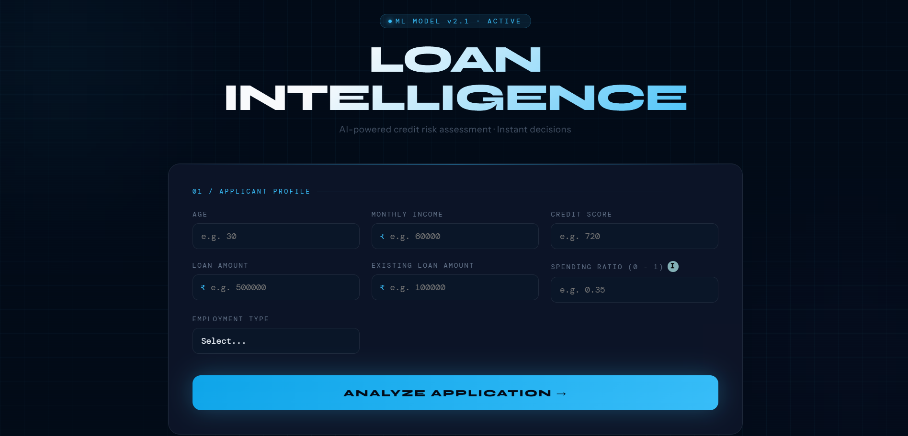
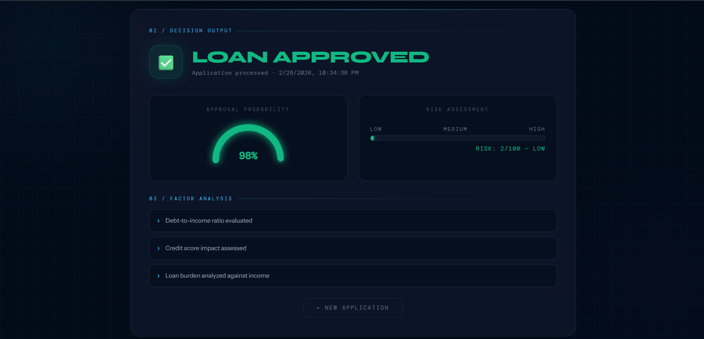
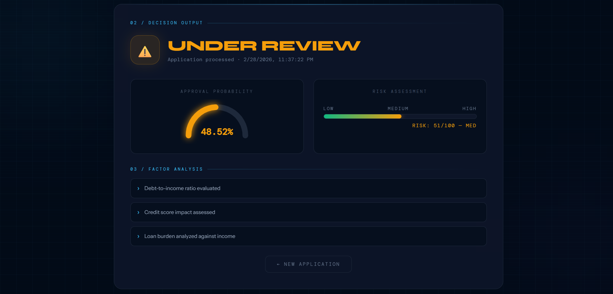
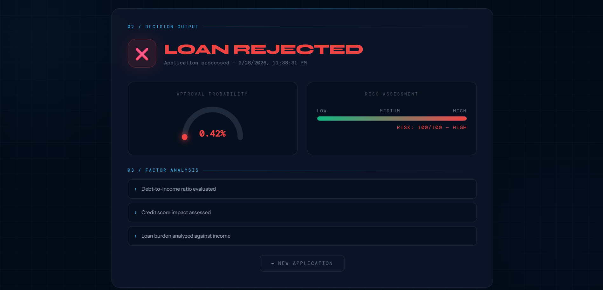

# loan-prediction-project
AI Decision Intelligence Platform
An end-to-end full-stack machine learning application that simulates a real-world fintech credit decision engine.

AI-Powered Credit Risk Scoring Engine

## 🧠 Model Decision Categories

- 🟢 Approved (≥ 65% probability)
- 🟡 Manual Review (40%–64%)
- 🔴 Rejected (< 40%)

Dynamic risk scoring implemented with FastAPI + React.

🔄 System Workflow

1.User submits loan application via React UI.

2.Data is sent to FastAPI backend.

3.Backend validates and preprocesses features.

4.Scikit-learn model predicts approval probability.

5.Threshold-based decision engine categorizes application.

6.Risk score is calculated dynamically.

7.Structured response is returned and rendered in dashboard.

## 📸 UI Screenshots

### 📝 Application Form

### 🟢 Approved Case

### 🟡 Manual Review Case

### 🔴 Rejected Case

### Architecture Diagram

Along with:

📊 Approval Probability

📈 Risk Score (0–100)

🧠 Factor Analysis Explanation

🌐 Live Demo

Frontend: [Add Your Vercel Link Here]
Backend API Docs: https://your-backend-url/docs

🏗 System Architecture

🧠 Project Overview

Loan Intelligence is designed to replicate how real banking credit systems evaluate loan applications using machine learning probability instead of simple binary classification.

Instead of only predicting Yes / No, the system:

Calculates probability of approval

Converts probability into risk score

Uses threshold-based decision segmentation

Supports manual review logic

This mimics real-world credit workflows used in fintech systems.

🔄 End-to-End Workflow
1️⃣ User Input (React Frontend)

Applicant enters financial details:

Age

Monthly Income

Credit Score

Loan Amount

Existing Loans

Spending Ratio

Employment Type

2️⃣ API Request (Frontend → Backend)

Frontend sends:

POST /predict

with structured JSON payload.

3️⃣ Backend Processing (FastAPI)

Backend performs:

Request validation (Pydantic schema)

Feature preprocessing

Scaling & transformation

Model inference

Probability extraction

4️⃣ Decision Engine Logic
if probability >= 0.65:
    decision = "Approved"
elif probability >= 0.40:
    decision = "Manual Review"
else:
    decision = "Rejected"

This enables realistic credit segmentation.

5️⃣ Risk Score Calculation
risk_score = (1 - probability) * 100

Higher risk score → Higher default risk.

6️⃣ API Response

Backend returns:

{
  "prediction": "Manual Review",
  "probability": 57.37,
  "risk_score": 43,
  "explanation": [...]
}
7️⃣ UI Rendering

React dynamically updates:

Verdict color

Gauge visualization

Risk gradient bar

Factor explanation

Timestamp

🛠 Tech Stack
🔹 Frontend

React.js

Custom dynamic UI components

SVG Gauge Visualization

Gradient risk bar

Real-time API integration

🔹 Backend

FastAPI

Pydantic validation

Modular architecture

Logging system

Scikit-learn model integration

🔹 Machine Learning

Scikit-learn classifier

Probability-based prediction

Feature engineering

Risk scoring logic

🔹 Deployment

Frontend → Vercel

Backend → Render

🧩 Features

✅ Full-stack ML deployment

✅ Probability-based credit scoring

✅ 3-tier decision logic

✅ Risk segmentation (Low / Medium / High)

✅ Interactive gauge visualization

✅ Production-style REST API

✅ Modular backend structure

✅ Clean fintech-inspired UI

📂 Project Structure
loan-intelligence/
│
├── backend/
│   ├── app/
│   │   ├── schemas.py
│   │   ├── inference.py
│   │   ├── logger.py
│   ├── main.py
│
├── frontend/
│   ├── src/
│   ├── components/
│
├── docs/
│   └── screenshots/
│
├── README.md
⚙ Installation (Local Setup)
Backend
cd backend
pip install -r requirements.txt
uvicorn app.main:app --reload

Visit:

http://localhost:8000/docs
Frontend
cd frontend
npm install
npm start
📊 Decision Categories
Category	Probability Range
🟢 Approved	≥ 65%
🟡 Manual Review	40% – 64%
🔴 Rejected	< 40%
🎯 Why This Project Matters

This project demonstrates:

ML model deployment into production APIs

Probability calibration usage

Full-stack integration

Risk-based decision modeling

Clean architecture separation

Real-world fintech simulation

🚀 Future Improvements

SHAP-based feature importance visualization

Model calibration (Platt scaling)

Authentication system

Database integration

Admin dashboard

Docker containerization

CI/CD automation

📬 Connect With Me

If you'd like to test your loan probability or collaborate:

LinkedIn: [Add your LinkedIn]

Email: [Add your email]

⭐ If You Found This Interesting

Feel free to star the repo and share feedback!
